Death Location Patterns
=======================

This dataset consists of 63,755 observations of death and 3 variables detailing the death occurence's position and time.

<center>

</center>
As you might expect, the majority of deaths occured within the lanes, and in partucilar, in the middle of the map for each lane. The middle lane appears to be the most active lane, while the top, the least.

There is one noticeable and somewhat unexpected aspect.

<center>

</center>
Take a look at these hotspots. The activity in these locations is rather high, especially as jungle locations. Perhaps these are the most popular (or maybe most successful) ganking locations.

Now, let's see how death occurences change with respect to time. In the image below, death location frequencies are depicted over four intervals, each representing a quarter of the interval (0, max(*t*)), where max(*t*) represents the largest timestamp value in the dataset. Even if, for one game, the end time occurs in the third interval, while, for another, in the fourth, this partitioning should give us a rough idea of what's going on.

<center>

</center>
The first interval depicts several interesting patterns. Most of the beginning of the game takes place in the middle part of each lane. This makes sense: players need to level up and earn money before they can be more adventurous. I wonder if there's more to the bottom lane having the most activity in this interval.

The fourth interval depicts something else interesting as well.

<center>

</center>
Compare the circled location above to the its respective location on images of other intervals: you will find that there is much more activity in that location in the fourth interval than any other. Not too surprising: that's where Baron Nashor is located, a monster typically killed in clinch games in order to gain a competitive edge. It should be noted that the activity here doesn't necessarily represent the Baron's capacity to kill players, although it certainly can; more likely, the activity highlights the Baron's appeal in the latter part of games.

Team Statistics
===============

``` r
match_teams <- read.csv('datasets-csv\\match_teams.csv')
match_teams$towerKills <- factor(match_teams$towerKills, ordered=TRUE)
match_teams$inhibitorKills <- factor(match_teams$inhibitorKills, ordered=TRUE)
match_teams <- data.table(match_teams)
```

This dataset consists of 2000 observations of teams from 1000 matches (two teams per match). The dataset records 12 variables. The matchId field serves as an index.

### Sanity Checks

    ##     matchId            winner     firstTower   firstInhibitor
    ##  Min.   :2.055e+09   False:1000   False:1000   False:1086    
    ##  1st Qu.:2.055e+09   True :1000   True :1000   True : 914    
    ##  Median :2.055e+09                                           
    ##  Mean   :2.055e+09                                           
    ##  3rd Qu.:2.055e+09                                           
    ##  Max.   :2.055e+09                                           
    ##                                                              
    ##  riftHeraldKills    baronKills     firstDragon   dragonKills   
    ##  Min.   :0.0000   Min.   :0.0000   False:1007   Min.   :0.000  
    ##  1st Qu.:0.0000   1st Qu.:0.0000   True : 993   1st Qu.:1.000  
    ##  Median :0.0000   Median :0.0000                Median :2.000  
    ##  Mean   :0.1645   Mean   :0.3675                Mean   :1.573  
    ##  3rd Qu.:0.0000   3rd Qu.:1.0000                3rd Qu.:2.000  
    ##  Max.   :3.0000   Max.   :4.0000                Max.   :6.000  
    ##                                                                
    ##  firstBlood   firstBaron     towerKills  firstRiftHerald inhibitorKills
    ##  False:1000   False:1416   10     :255   False:1706      0      :979   
    ##  True :1000   True : 584   11     :207   True : 294      1      :372   
    ##                            9      :202                   2      :340   
    ##                            1      :187                   3      :217   
    ##                            8      :167                   4      : 60   
    ##                            0      :164                   5      : 25   
    ##                            (Other):818                   (Other):  7

The major function of this summary is as a sanity check. That is:

-   *Does every match end definitively? I.e., is there a winner and a loser?* Yes. The dataset consists of teams from 1000 matches and there are 1000 winners and losers.

Moreover, the summary provides insight into the way in which wins were achieved:

-   *Does the summary read 1000 True/False for firstTower? What about for firstInhibitor? What do the answers to these questions mean?* It does for firstTower but not for firstInhibitor. What does this mean? Well, we know that at least one inhibitor must be destroyed before the towers guarding the nexus can be targeted, and these towers must be destroyed before the nexus can be targeted. So if the number of False values exceeds 1000 by 86, then at least 86 matches must have concluded in a surrender.

The summary indicates something else, which actually surprised me. From my experience, I expected that the frequency of Baron Nashor kills would be far larger than that of the dragon. This data, however, suggests the opposite, with 993 True for firstDragon and 584 True for firstBaron.

### Tower and Inhibitor Destruction Numbers

We'd expect that the number of teams who won increases as a function of the number of towers destroyed. Let's see if this is true.

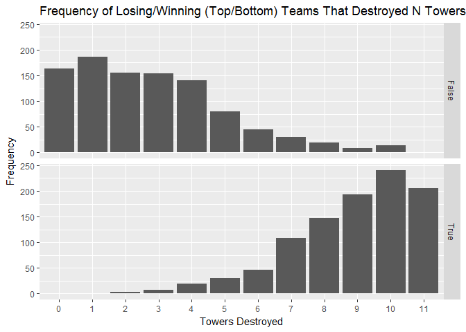

Indeed, this figure generally supports our expectation. This pattern is violated around 10-11 for winning teams; but the fact that the number of teams who destroyed 11 towers is smaller than the number of teams who destroyed 10 may suggest that there isn't much of a gain from having destroyed every tower. You can probably think of many matches in which this makes sense.

On another note, don't be alarmed by the existence of teams who won without having destroyed at least 6 towers (recall that the minimal conditions for a victory without surrender is the destruction of all towers in a lane + its inhibitor's tower + both nexus towers), as this isn't necessarily an indication of faulty data. Remember that at least 86 matches ended by surrender.

Let's take a quick detour. We may not have an expectation of the relationship between towers destroyed and whether a particular monster was killed (at least I don't). So let's graph that relationship and see if it reveals anything.

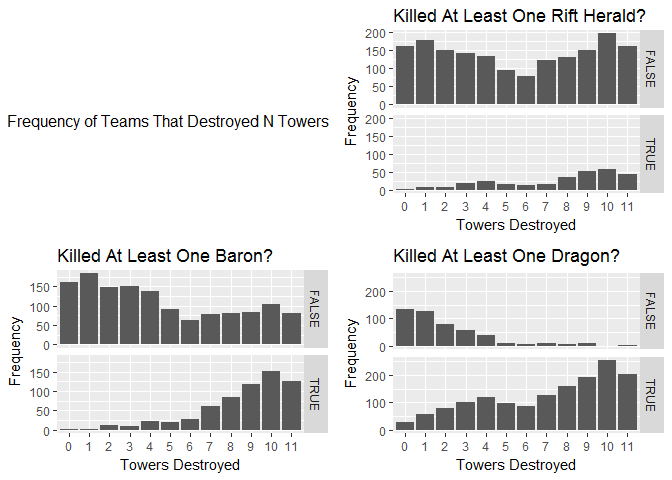

As far as the dragon and Baron Nashor are concerned, there does appear to be a slight-to-moderate trend. However, no trend appears with respect to the rift herald.

Returning to faceting by win, let's now add another variable to this investigation.

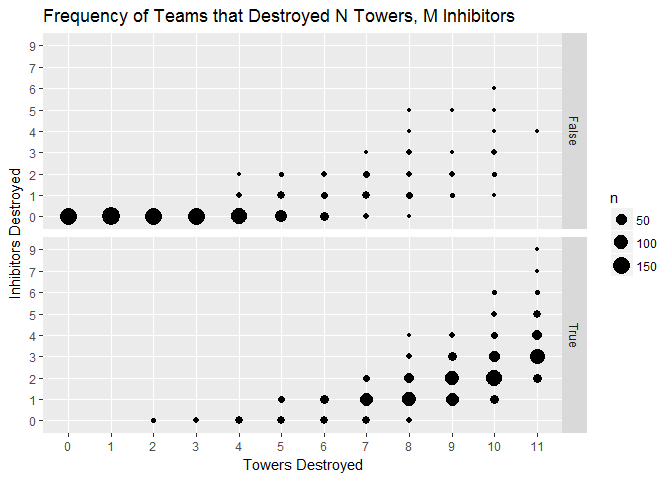

That inhibitors and towers destroyed have a monotonic relationship doesn't reveal anything, since the scheme of the game imposes this as a condition for victory. What is somewhat revealing, though, is the team frequency, particularly with regard to losing teams. It seems that the vast majority of losing teams either: 1) didn't destroy enough towers to be able to destroy an inhibitor or 2) destroyed enough towers but didn't destroy an inhibitor. Perhaps this speaks to the importance of a key aspect to success in many LoL matches: momentum.

### Early Momentum

Good momentum built early in the match should better position a team for victory. In the following two graphs, we will investigate whether this true.


This diagram reveals a lot. Notably:

-   First blood isn't as strong of an indicator of victory as the other two categories.
-   Being first to destroy an inhibitor appears to be the strongest indicator of victory, as a vast majority of these winners destroyed the first inhibitor. The proportion may even be larger than what's depicted, since 86 matches ended before an inhibitor was even destroyed.

We can consider the number of towers destroyed with these variables as well.

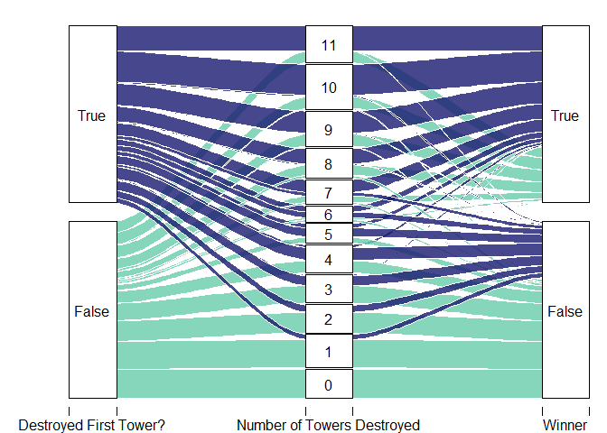

This diagram shows that having destroyed the first tower is a fairly strong indicator of destroying more towers.

Champion Popularity
===================

``` r
champ_popularity <- read.csv('datasets-csv\\champ_popularity.csv')
```

This dataset consists of 128 observations of champions. The dataset records the frequency of champion choice by tier for 1000 matches.

We won't spend much time in this section. Our primary interest here is to identify the most/least popular champions chosen by players of each tier.

<center>

</center>
Miss Fortune is quite popular, appearing in 6 out of the 8 tiers and being the most popular champion in total.

<center>

</center>
Yorick is quite unpopular, appearing in 7 out of the 8 tiers adn being the least popular champion in total.

First Blood Times
=================

``` r
# the matchId column serves as an index
firstBlood_times <- read.csv('datasets-csv\\firstBlood_times.csv')
```

This dataset consists of 1000 observations of matches. The dataset records the time at which the match's first blood occurred.

Our objective with this dataset is to come up with a confidence interval for some measure of central tendency of the distribution of the first blood times. Thus we should first plot the times in order to see: 1) what measure of central tendency will work best with our data and 2) if rudimentary methods for constructing confidence intervals can be used (i.e. is the distribution of the data reasonably symmetric?)

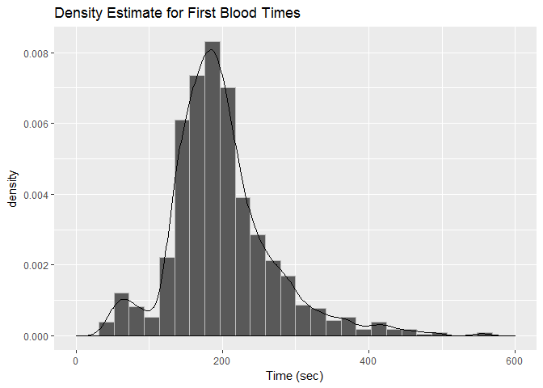

The graph may, at first glance, appear normal, albeit a bit skewed. What worries me is the second hump to the left of the first. Because of that hump, I don't feel that we should construct a confidence interval using rudimentary methods, nor do I think we should use the mean as the measure of central tendency. Instead, we should use the median.

### Bootstrapping for Median's Confidence Interval

    ## BOOTSTRAP CONFIDENCE INTERVAL CALCULATIONS
    ## Based on 3000 bootstrap replicates
    ## 
    ## CALL : 
    ## boot.ci(boot.out = theta_boot_median, conf = 1 - alpha)
    ## 
    ## Intervals : 
    ## Level      Normal              Basic         
    ## 95%   (185.9, 192.6 )   (185.9, 192.5 )  
    ## 
    ## Level     Percentile            BCa          
    ## 95%   (186.0, 192.7 )   (186.0, 192.7 )  
    ## Calculations and Intervals on Original Scale

We typically regard as most favorable the bias-corrected and accelerated (BCa) boostrap confidence interval; it will be our chosen confidence interval here.

Level Up Times
==============

This dataset consists of 146,096 observations of players for 1000 matches. The dataset records 6 variables. The matchId and participantId fields serve as indices.

``` r
levelUp_times <- read.csv('datasets-csv\\levelUp_times.csv')
levelUp_times[, 'highestAchievedSeasonTier'] <- 
  factor(levelUp_times$highestAchievedSeasonTier,
         levels=c('UNRANKED', 'BRONZE' , 'SILVER', 'GOLD',
                  'PLATINUM', 'DIAMOND', 'MASTER', 'CHALLENGER'),
         ordered=TRUE)
levelUp_times <- data.table(levelUp_times)
```

    ## # A tibble: 6 × 5
    ##   lvlAchieved first_quartile_in_sec median_time_in_sec
    ##         <int>                 <dbl>              <dbl>
    ## 1          18              1965.144           2126.664
    ## 2          19              2136.694           2286.589
    ## 3          20              1756.170           1875.362
    ## 4          21              1947.881           2037.451
    ## 5          22              2138.083           2231.167
    ## 6          23              2011.807           2011.807
    ## # ... with 2 more variables: third_quartile_in_sec <dbl>, n <int>

It may not be surprising that the median times increase as the level achieved increases. However, this is not always true. For levels after 19, the strictly monotone relationship deteriorates. We will see this in the figure below.

Also shown below: the distribution of levels 20 and above are shifted to the left quite a bit in comparison to the levels just below 20.

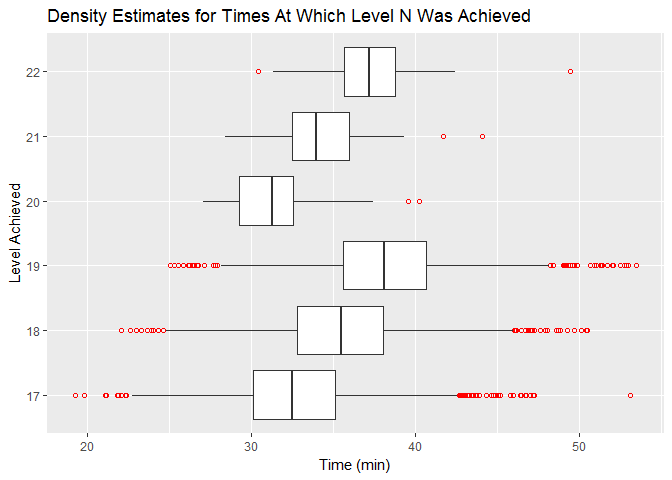

We should be a bit skeptical of these values for levels 20 and above. Why? Remember from the summary report that the size of each group is very small. So perhaps for those groups our data isn't a good representation of the population. Personally, I've never played a game where in which I achieved a level above 19 (or maybe I have but I don't remember because there aren't any more skills to upgrade). For this reason, I've decided to exclude these levels from further analysis.

All that considered, let's now look at a frequency plot for all levels. We will divide the plots in two so that they are easier to read.

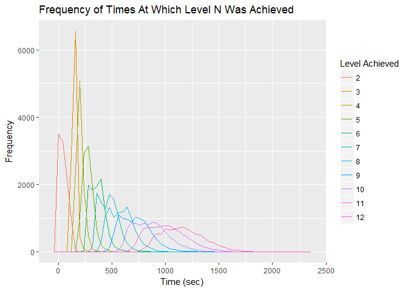

Let's first take care of the, what may at first appear to be, strange pattern between level 2 and 3. You probably expect that frequency will becomes less concentrated as a function of increasing level; for, as one levels up, it becomes harder to do so, and higher performing players will outpace their counterparts. Thus level 3's frequency shouldn't be much more concentrated than level 2. From my experience, I suspect that this strange pattern is a result of players being away from the keyboard (AFK) at the beginning of the game—something which happens quite often. But this is not certain. In any case, for all other levels, the frequency does become less concentrated as a function of increasing level. See the graph above and the graph below to confirm.

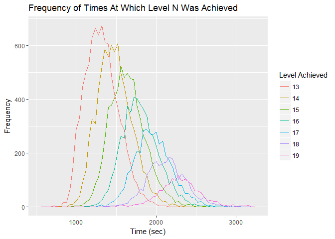

Now, let's compare the median times to achieve a certain level.

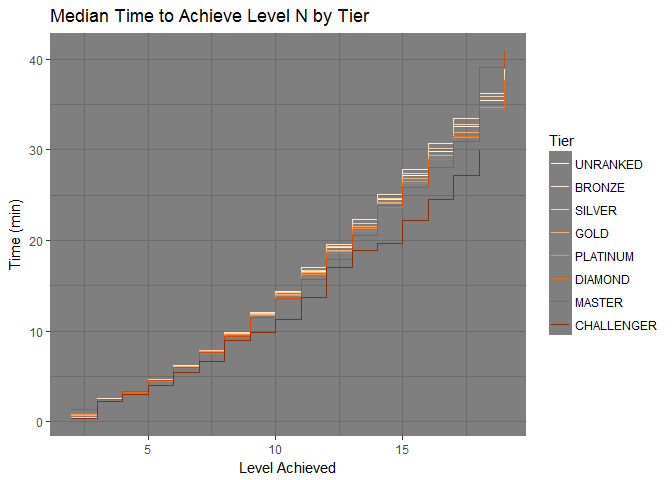

The median times do appear to disperse as a function of increasing level, although the details of the dispersion may not be clear.

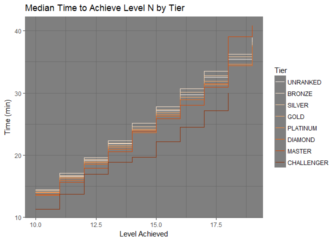

Indeed, this chart clairifies the dispersion. As expected, the median time to achieve level n generally appears to decrease as tier level increases—i.e., median times for the bronze tier become higher than diamond as level increases. This is not true for the unranked tier, whose median times float between those of silver and gold. But since the unranked tier could contain players who might belong to any tier, this isn't too surprising.

Kills/Deaths/Assits
===================

``` r
kda_performance <- read.csv('datasets-csv\\kda_performance.csv')
kda_performance[, 'highestAchievedSeasonTier'] <- 
  factor(kda_performance$highestAchievedSeasonTier,
         levels=c('UNRANKED', 'BRONZE' , 'SILVER', 'GOLD',
                  'PLATINUM', 'DIAMOND', 'MASTER', 'CHALLENGER'),
         ordered=TRUE)
```

This dataset consists of 10,000 observations of players for 1000 matches. The dataset records 5 variables. The summonerId field serves as an index.

    ## # A tibble: 8 × 4
    ##   highestAchievedSeasonTier mean_performance median_performance     n
    ##                       <ord>            <dbl>              <dbl> <int>
    ## 1                  UNRANKED        0.3173221          0.3684211  1211
    ## 2                    BRONZE        0.3493689          0.3846154  1476
    ## 3                    SILVER        0.3595191          0.4117647  3439
    ## 4                      GOLD        0.3778165          0.4222222  2293
    ## 5                  PLATINUM        0.3771016          0.4285714  1146
    ## 6                   DIAMOND        0.3775137          0.4146341   401
    ## 7                    MASTER        0.4847107          0.5151515    27
    ## 8                CHALLENGER        0.4001309          0.3333333     7

It is important to discuss how 'performance' was measured here. I wanted a metric that: 1) was normalized and 2) would take into account kills, assists, and deaths so that all three could be easily depicted in one graph.

Now, what immediately came to mind was a metric that I use for sports data. This metric works as follows: for *w* wins, *t* ties, and *l* losses, the performance measure *p* is defined as $p(w, t, l) = \\frac{w - l}{w + t + l}$. The issue is that the way in which this metric assigns values to wins, ties, and losses makes intuitive sense for sports data but just doesn't translate well to LoL K/D/A data. A kill is intuitively +1, a death -1, but what's intuitive about assigning 0 to an assist? In fact, pretty much any value assigned to assists seems somewhat arbitrary.

In the end, I decided, based on my experience in the game, that +1 should be assigned to assists. So the performance measure here is the following: for *k* kills, *a* assists, and *d* deaths, the performance measure *p* is defined as $p=\\frac{k + a - d}{k + a + d}$. In deciding this, I thought about all those moments when I depleted an enemy champion's HP to nearly, but not quite, 0; the enemy managed to escape me but not another player, who entered the scene and made an easy picking. Why should the assist be valued less than the kill in this scenario? It shouldn't.

Now that the performance measure has been explained, let's get to interpreting the statistics. Since tiers are, in general, paired together in match making, we should expect that the mean and median performances for each would be roughly the same. Between bronze and diamond, this does appear to be true. Master and Challenger tiers deviate from this pattern, but that's to be expected. After all, the challengers are literally the best LoL players in the world.

But which measure of central tendency is the most accurate? Considering that the performances are quite skewed for each (see graph below), we should go with the median.

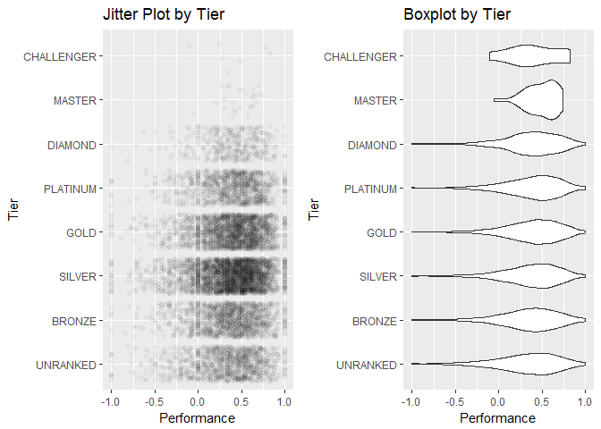

------------------------------------------------------------------------

Final Plots and Summary
=======================

### Plot and Description One

<center>

</center>
The first interval depicts several interesting patterns. Most of the beginning of the game takes place in the middle part of each lane. This makes sense: players need to level up and earn money before they can be more adventurous. I wonder if there's more to the bottom lane having the most activity in this interval.

The fourth interval depicts something else interesting as well.

<center>

</center>
Compare the circled location above to the its respective location on images of other intervals: you will find that there is much more activity in that location in the fourth interval than any other. Not too surprising: that's where Baron Nashor is located, a monster typically killed in clinch games in order to gain a competitive edge. It should be noted that the activity here doesn't necessarily represent the Baron's capacity to kill players, although it certainly can; more likely, the activity highlights the Baron's appeal in the latter part of games.

### Plot Two

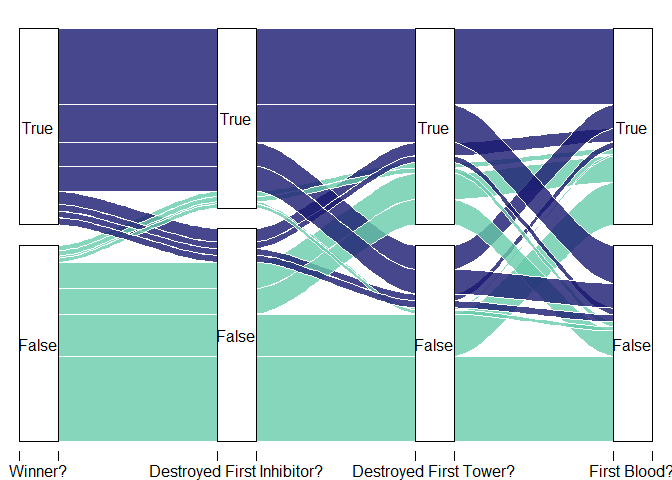

### Description Two

This diagram reveals a lot. Notably: 1) First blood isn't as strong of an indicator of victory as the other two categories. 2) Being first to destroy an inhibitor appears to be the strongest indicator of victory, as a vast majority of these winners destroyed the first inhibitor. The proportion may even be larger than what's depicted, since 86 matches ended before an inhibitor was even destroyed.

### Plot Three


### Description Three

The median time to achieve level n generally appears to decrease as tier level increases—i.e., median times for the bronze tier become higher than diamond as level increases. This is not true for the unranked tier, whose median times float between those of silver and gold. But since the unranked tier could contain players who might belong to any tier, this isn't too surprising.

------------------------------------------------------------------------

Reflection
==========

The analysis was, by and large, a success in my opinion—to such an extent that I would like to use these datasets for future analyses (and perhaps develop them even further).

Nonetheless, there were a few areas with which I did struggle—notably, the peformance measure. Even though it is a sufficient measure for the moment, I would like to have a measure that feels as intuitive as the performance measures for other sports.

### Future Work

Here are several exploratory questions for future work:

1.  Can we determine a reason for the high death activity in the bottom lane during the early stages of the game?
2.  Can we determine a reason for the relationship uncovered in this analysis between monster kills and towers destroyed?
3.  Does the relative kill it takes to successfully play a champion correlate with a champion's tier popularity? I.e., are harder champions favored by players in a higher tier?

Personally, I would really like to study ward placement patterns. But from what I've read in the forums, Riot doesn't disclose this information because players can use it to study the actions of other players (don't sports teams do this?). Maybe in the future they can release ward placement datasets with redacted summonerId entries?

Other interesting directions to investigate revolve around constructing models to predict winning teams.
